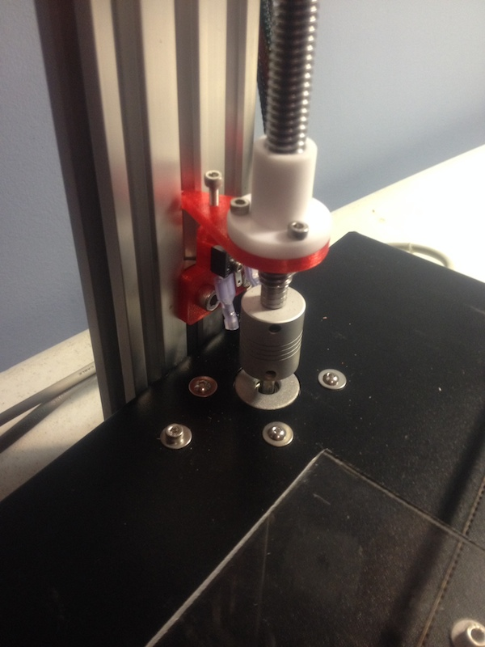
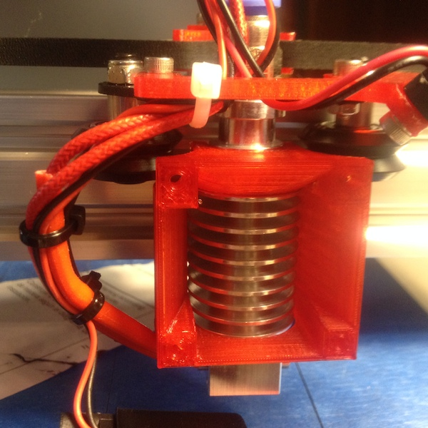
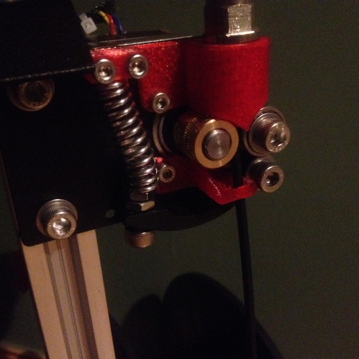

# Fusematic 3D Printer

It's awesome, [buy one](http://store.makerstoolworks.com/printers-kits/fusematic-3d-printer/). Seriously. Right now.
Anything even remotely close to the price range is a rattle trap, or slower, or smaller, or some combination.

## Modified Z Isolation

The modification includes a new Z endstop, a new isolator, and an optional 'foot' for the adjustment screw.
In order to use this, the delrin nut will have to be turned so that the flange faces downwards.
Additionally, it rotates the screw holes by 30&deg; to create more clearance for the X extrusion on the delrin nut.

## Custom 40mm Fan Shroud

This fan shroud has been designed just for the fusematic. It features a big 40mm size, clearance for the wheels on the X axis, holes resized for M3 screws, and a retaining clip on the top to prevent the awful rattle horrible you get with the stock e3d shroud.

## Modified X Endstop Mount

This modification puts the switch trigger right where the v-wheel rolls and also adds another 10mm or so to the X axis.
Depending on your glass you may or may not be able to actually take advantage of it.

## Modified Z Sprung Bearings

This modification is intended to solve 3 problems.

* Get easier access to the X idler
* Remove deflection in the X idler from the stock spacer
* Make room in the X to move the idler far enough over that the stop is now the wheel on the end.

## Lower Filament Guide

Stock lower filament guide

